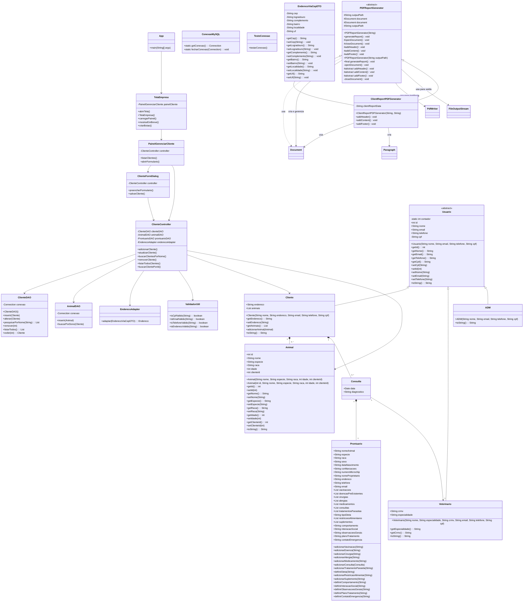

```mermaid
classDiagram
    direction TB

    %% Camada de Apresentação (View)
    class App {
        +main(String[] args)
    }

    class TelaEmpresa {
        -PainelGerenciarCliente painelCliente
        +abrirTela()
        +TelaEmpresa()
        +carregarPainel()
        +mostrarEmBreve()
        +criarBotao()
    }

    class PainelGerenciarCliente {
        -ClienteController controller
        +listarClientes()
        +abrirFormulario()
    }

    class ClienteFormDialog {
        -ClienteController controller
        +preencherFormulario()
        +salvarCliente()
    }

    %% Camada de Controle (Controller)
    class ClienteController {
        -ClienteDAO clienteDAO
        -AnimalDAO animalDAO
        -ProntuarioDAO prontuarioDAO
        -EnderecoAdapter enderecoAdapter
        +adicionarCliente()
        +atualizarCliente()
        +buscarClientesPorNome()
        +removerCliente()
        +listarTodosClientes()
        +buscarClientePorId()
    }

    %% Camada de Modelo (Model)
    class Usuario {
        <<abstract>>
        -static int contador
        +int id
        +String nome
        +String email
        +String telefone
        -String cpf
        +Usuario(String nome, String email, String telefone, String cpf)
        +getId(): int
        +getNome(): String
        +getEmail(): String
        +getTelefone(): String
        +getCpf(): String
        +setCpf(String)
        +setId(int)
        +setNome(String)
        +setEmail(String)
        +setTelefone(String)
        +toString(): String
    }
    
    class Cliente {
        +String endereco
        +List<Animal> animais
        +Cliente(String nome, String endereco, String email, String telefone, String cpf)
        +getEndereco(): String
        +setEndereco(String)
        +getAnimais(): List<Animal>
        +adicionarAnimal(Animal)
        +toString(): String
    }

    class Animal {
        +int id
        +String nome
        +String especie
        +String raca
        +int idade
        +int clienteId
        +Animal(String nome, String especie, String raca, int idade, int clienteId)
        +Animal(int id, String nome, String especie, String raca, int idade, int clienteId)
        +getId(): int
        +setId(int)
        +getNome(): String
        +setNome(String)
        +getEspecie(): String
        +setEspecie(String)
        +getRaca(): String
        +setRaca(String)
        +getIdade(): int
        +setIdade(int)
        +getClienteId(): int
        +setClienteId(int)
        +toString(): String
    }

    class Veterinario {
        +String crmv
        +String especialidade
        +Veterinario(String nome, String especialidade, String crmv, String email, String telefone, String cpf)
        +getEspecialidade(): String
        +getCrmv(): String
        +toString(): String
    }

    class ADM {
        +ADM(String nome, String email, String telefone, String cpf)
        +toString(): String
    }

    class Consulta {
        +Date data
        +String diagnostico
    }

    class Prontuario {
        +String nomeAnimal
        +String especie
        +String raca
        +String sexo
        +String dataNascimento
        +String corMarcacoes
        +String numeroMicrochip
        +String nomeProprietario
        +String endereco
        +String telefone
        +String email
        +List<String> vacinacoes
        +List<String> doencasPreExistentes
        +List<String> cirurgias
        +List<String> alergias
        +List<String> medicamentos
        +List<Consulta> consultas
        +List<String> tratamentosParasitas
        +String tipoDieta
        +List<String> restricoesAlimentares
        +List<String> suplementos
        +String comportamento
        +String interacaoSocial
        +String observacoesGerais
        +String planoTratamento
        +String contatoEmergencia
        +adicionarVacinacao(String)
        +adicionarDoenca(String)
        +adicionarCirurgia(String)
        +adicionarAlergia(String)
        +adicionarMedicamento(String)
        +adicionarConsulta(Consulta)
        +adicionarTratamentoParasita(String)
        +definirDieta(String)
        +adicionarRestricaoAlimentar(String)
        +adicionarSuplemento(String)
        +definirComportamento(String)
        +definirInteracaoSocial(String)
        +definirObservacoesGerais(String)
        +definirPlanoTratamento(String)
        +definirContatoEmergencia(String)
    }

    %% Camada de Persistência (DAO)
    class ClienteDAO {
        -Connection conexao
        +ClienteDAO()
        +inserir(Cliente)
        +alterar(Cliente)
        +pesquisarPorNome(String): List<Cliente>
        +remover(int)
        +listarTodos(): List<Cliente>
        +exibir(int): Cliente
    }

    class AnimalDAO {
        -Connection conexao
        +inserir(Animal)
        +buscarPorDono(Cliente)
    }

    class ConexaoMySQL {
        +static getConexao(): Connection
        +static fecharConexao(Connection): void
    }

    class TesteConexao {
        +testarConexao()
    }

    %% Padrão Adapter/DTO
    class EnderecoAdapter {
        +adaptar(EnderecoViaCepDTO): Endereco
    }

    class EnderecoViaCepDTO {
        -String cep
        -String logradouro
        -String complemento
        -String bairro
        -String localidade
        -String uf
        +getCep(): String
        +setCep(String): void
        +getLogradouro(): String
        +setLogradouro(String): void
        +getComplemento(): String
        +setComplemento(String): void
        +getBairro(): String
        +setBairro(String): void
        +getLocalidade(): String
        +setLocalidade(String): void
        +getUf(): String
        +setUf(String): void
    }

    class PDFReportGenerator {
        <<abstract>>
        #String outputPath
        #Document document
        +PDFReportGenerator(String)
        +generateReport() void
        #openDocument() void
        #closeDocument() void
        #addHeader()* void
        #addContent()* void
        #addFooter()* void
    }

    class ClientReportPDFGenerator {
        -String clientReportData
        +ClientReportPDFGenerator(String, String)
        +addHeader() void
        +addContent() void
        +addFooter() void
    }

     class PDFReportGenerator {
        <<abstract>>
        #Document document
        #String outputPath
        +PDFReportGenerator(String outputPath)
        +final generateReport() void
        -openDocument() void
        #abstract addHeader()* void
        #abstract addContent()* void
        #abstract addFooter()* void
        -closeDocument() void
    }

    %% Utilitários
    class ValidadorUtil {
        +isCpfValido(String): boolean
        +isEmailValido(String): boolean
        +isTelefoneValido(String): boolean
        +isEnderecoValido(String): boolean
    }

    %% Relacionamentos
    App --> TelaEmpresa
    TelaEmpresa --> PainelGerenciarCliente
    PainelGerenciarCliente --> ClienteFormDialog
    PainelGerenciarCliente --> ClienteController
    ClienteFormDialog --> ClienteController

    ClienteController --> ClienteDAO
    ClienteController --> AnimalDAO
    ClienteController --> EnderecoAdapter
    ClienteController --> ValidadorUtil
    ClienteController --> Cliente
    ClienteController --> Animal

    Usuario <|-- Cliente
    Usuario <|-- Veterinario
    Usuario <|-- ADM
    Cliente "1" *-- "0..*" Animal
    Cliente "1" *-- "0..*" Consulta
    Consulta "1" *-- "1" Prontuario
    Consulta "1" --> "1" Veterinario

    PDFReportGenerator <|-- ClientReportPDFGenerator
    ClientReportPDFGenerator --> Document : usa
    ClientReportPDFGenerator --> Paragraph : cria
    PDFReportGenerator ..> Document : usa

    PDFReportGenerator --> Document : cria e gerencia
    PDFReportGenerator --> PdfWriter : usa para instância
    PDFReportGenerator --> FileOutputStream : usa para saída
    PDFReportGenerator <|-- ClientReportPDFGenerator
  
```
